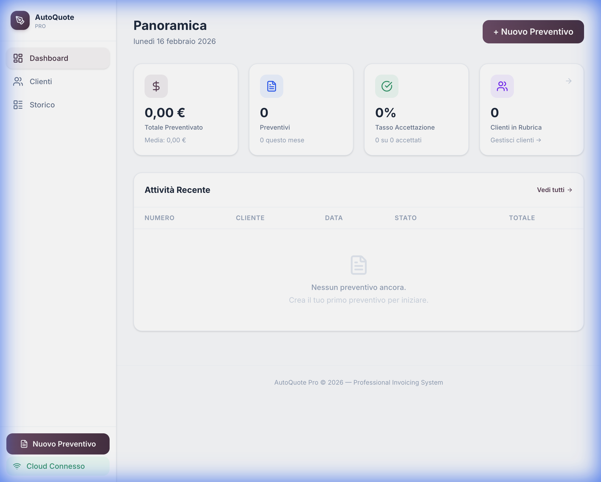
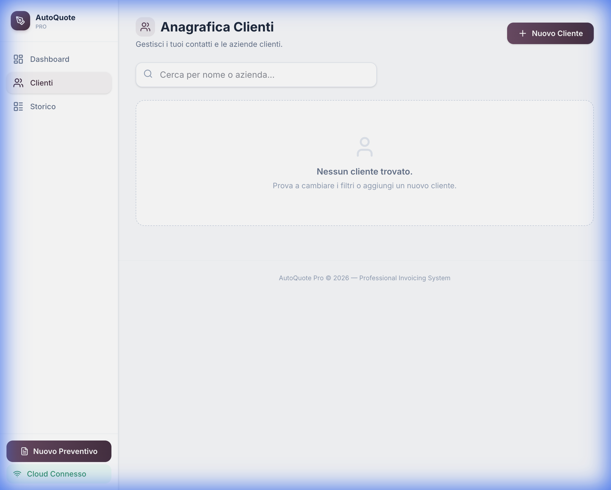
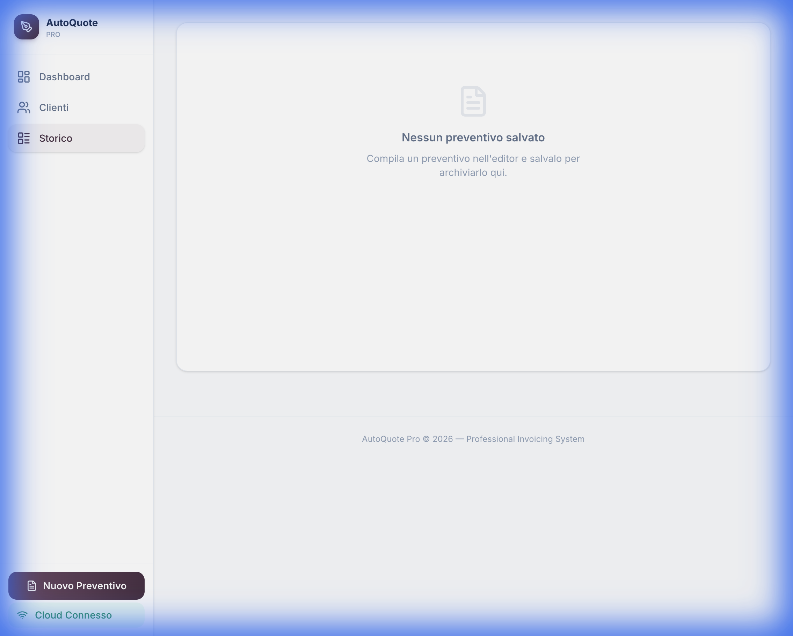

<div align="center">
  <h1>📋 AutoQuote Pro</h1>
  <p><strong>Generatore di preventivi professionali con sincronizzazione Cloud e assistente AI integrato.</strong></p>
  
  <p>
    
    
    
    
    
    
  </p>
</div>

<div align="center">
  <br />
  <a href="https://vercel.com/new/clone?repository-url=https%3A%2F%2Fgithub.com%2FBaglion00%2FCRM-Pro">
    
  </a>
  &nbsp;
  <a href="https://app.netlify.com/start/deploy?repository=https://github.com/Baglion00/CRM-Pro">
    
  </a>
</div>

---

## ✨ Perché questo CRM?

Spesso i CRM "famosi" sono troppo complessi, costosi o non adattati alla burocrazia italiana. **AutoQuote Pro** nasce per colmare questo vuoto:

- ✅ **Niente abbonamenti mensili**: Il codice è tuo.
- ✅ **Privacy Totale**: I dati stanno nel tuo browser o nel tuo Supabase privato.
- ✅ **Stile Premium**: Per fare bella figura coi clienti anche dal preventivo.
- ✅ **Italiano Nativo**: Predisposto per P.IVA, C.F., Bollo e Ritenuta.

---

## ✨ Panoramica

**AutoQuote Pro** è un'applicazione web moderna per la creazione, gestione e archiviazione di preventivi professionali. Progettata per freelancer, professionisti e piccole aziende italiane, offre un'interfaccia intuitiva con sincronizzazione cloud in tempo reale.

### 🎯 Caratteristiche Principali

| Feature | Descrizione |
|---|---|
| 📝 **Editor Preventivi** | Editor completo con anteprima live in formato A4 e download PDF istantaneo |
| 📊 **Dashboard Analitica** | KPI cards con totale preventivato, tasso di accettazione, conteggio mensile |
| 👥 **Anagrafica Clienti** | Gestione completa dei contatti con ricerca e selezione rapida |
| 📂 **Archivio Storico** | Filtri per stato (Bozza, Inviato, Accettato, Rifiutato) |
| ☁️ **Cloud Sync** | Sincronizzazione automatica tramite Supabase (opzionale) |
| 🤖 **AI Assistant** | Miglioramento automatico delle descrizioni dei servizi |
| 🌐 **Auto-Fill Azienda** | Compilazione automatica dei dati aziendali da URL |
| 📱 **Responsive** | Design adattivo per desktop, tablet e mobile |
| 🖨️ **PDF Export** | Generazione PDF professionale con un click |
| 🇮🇹 **Regime Forfettario** | Note preconfigurate per il regime forfettario italiano |

---

## 🚀 Quick Start

### Prerequisiti

- [Node.js](https://nodejs.org/) v18+ 
- Un account [Supabase](https://supabase.com) gratuito (opzionale, per il cloud sync)

### Installazione

```bash
# 1. Clona il repository
git clone https://github.com/Baglion00/AutoQuote-Pro.git
cd AutoQuote-Pro

# 2. Installa le dipendenze
npm install

# 3. Configura le variabili d'ambiente
cp .env.example .env
# Modifica .env con le tue credenziali Supabase (opzionale)

# 4. Avvia il server di sviluppo
npm run dev
```

L'app sarà disponibile su **http://localhost:3000**

### Build di Produzione

```bash
npm run build
npm run preview
```

---

## ⚙️ Configurazione

Copia `.env.example` in `.env` e configura le variabili:

| Variabile | Descrizione | Obbligatorio |
|---|---|---|
| `VITE_SUPABASE_URL` | URL del tuo progetto Supabase | Solo per cloud sync |
| `VITE_SUPABASE_KEY` | Chiave anon del progetto Supabase | Solo per cloud sync |
| `VITE_AI_API_KEY` | API Key per il servizio AI | Solo per funzioni AI |

> **Nota:** L'app funziona perfettamente anche senza cloud sync — in quel caso i dati vengono salvati nel localStorage del browser.

---

## 🗄️ Setup Supabase

Se vuoi abilitare la sincronizzazione cloud, crea le seguenti tabelle nel tuo progetto Supabase:

<details>
<summary><strong>📋 SQL per creare le tabelle</strong></summary>

```sql
-- Tabella Preventivi
CREATE TABLE quotes (
  id UUID PRIMARY KEY DEFAULT gen_random_uuid(),
  number TEXT NOT NULL,
  date DATE NOT NULL,
  expiry_date DATE,
  company JSONB NOT NULL,
  client JSONB NOT NULL,
  items JSONB NOT NULL,
  notes TEXT,
  currency TEXT DEFAULT 'EUR',
  status TEXT DEFAULT 'draft',
  created_at TIMESTAMP WITH TIME ZONE DEFAULT NOW(),
  updated_at TIMESTAMP WITH TIME ZONE DEFAULT NOW()
);

-- Tabella Clienti
CREATE TABLE clients (
  id UUID PRIMARY KEY DEFAULT gen_random_uuid(),
  name TEXT NOT NULL,
  company TEXT,
  email TEXT,
  address TEXT,
  vat_id TEXT,
  phone TEXT,
  created_at TIMESTAMP WITH TIME ZONE DEFAULT NOW()
);

-- Tabella Impostazioni Aziendali
CREATE TABLE company_settings (
  id UUID PRIMARY KEY DEFAULT gen_random_uuid(),
  name TEXT,
  email TEXT,
  phone TEXT,
  address TEXT,
  vat_id TEXT,
  logo_url TEXT,
  website TEXT,
  iban TEXT,
  created_at TIMESTAMP WITH TIME ZONE DEFAULT NOW()
);
```

</details>

---

## 🛠️ Tech Stack

- **Frontend:** React 19 + TypeScript 5.8
- **Styling:** Tailwind CSS v4 (via `@tailwindcss/vite`)
- **Bundler:** Vite 6
- **Database:** Supabase (PostgreSQL)
- **Icons:** Lucide React
- **PDF:** html2pdf.js

---

## 📁 Struttura Progetto

```
AutoQuote-Pro/
├── App.tsx                  # Componente principale con routing e sidebar
├── index.html               # Entry point HTML
├── index.css                # Design system (Tailwind theme + animazioni)
├── index.tsx                # Bootstrap React
├── types.ts                 # Tipi TypeScript e configurazioni
├── components/
│   ├── Dashboard.tsx        # KPI cards e tabella attività recente
│   ├── EditorPanel.tsx      # Editor del preventivo (dati, voci, note)
│   ├── QuotePreview.tsx     # Anteprima A4 per stampa/PDF
│   ├── HistoryPanel.tsx     # Archivio con filtri di stato
│   ├── ClientsPanel.tsx     # Anagrafica clienti
│   ├── CloudSettings.tsx    # Configurazione Supabase
│   └── ui/
│       ├── ConfirmDialog.tsx # Dialog di conferma custom
│       └── Toast.tsx        # Notifiche toast animate
├── services/
│   ├── aiService.ts         # Servizio AI per descrizioni e auto-fill
│   └── supabaseClient.ts   # Client Supabase per operazioni CRUD
└── .env.example             # Template variabili d'ambiente
```

---

## 📸 Screenshots

<div align="center">

| Dashboard | Clienti |
|---|---|
|  |  |

| Storico Preventivi |
|---|
|  |

</div>

---

## 🤝 Contributing

Le contribuzioni sono benvenute! Sentiti libero di:

1. Forkare il repository
2. Creare un branch per la tua feature (`git checkout -b feature/nuova-feature`)
3. Committare le modifiche (`git commit -m 'Aggiunta nuova feature'`)
4. Pushare il branch (`git push origin feature/nuova-feature`)
5. Aprire una Pull Request

---

## 📄 Licenza

Questo progetto è distribuito con licenza **MIT**. Vedi il file [LICENSE](LICENSE) per maggiori dettagli.

---

<div align="center">
  <p>Creato con ❤️ da <strong>Andrea Baglioni</strong></p>
  <p>
    <a href="https://github.com/Baglion00">GitHub</a>
  </p>
</div>
